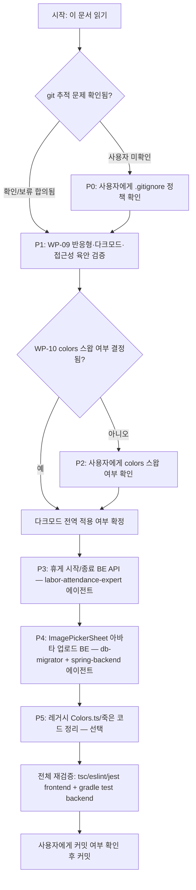

# V3 "링 & 패스" 디자인 시스템 — Codex 인수인계 문서

작성일: 2026-07-26 (Claude 세션에서 작성, Codex가 릴레이로 이어받아 작업하기 위한 문서)

## 0. 이 문서를 읽는 방법

이 문서 하나만 읽으면 별도 세션 맥락 없이 다음을 알 수 있다:
1. 지금까지 뭐가 어디까지 됐는지 (파일 경로·커밋 해시 포함)
2. 디자인 시안(아티팩트) 153개 화면을 어디서 어떻게 보는지
3. 다음에 뭘 해야 하는지 (우선순위·의존관계·작업 순서)
4. 각 작업을 어떻게 검증하는지 (실행 명령어)
5. 절대 건드리면 안 되는 것 (노무사 게이트)

배경 계획서는 같은 디렉터리의 `260720_V3_링패스_적용_계획서.md`(§4 화면 매핑표, §13 실제 진행 현황)다. 이 문서와 그 계획서가 어긋나면 **실제 코드 상태 쪽을 신뢰할 것** — 계획서 자체가 "감사 결과 문서가 코드보다 뒤처져 있었다"고 여러 번 자체 정정한 이력이 있다(§13 서두 참조).

## 1. 지금까지 진행 상황 요약

| 단계 | 시기 | 상태 |
|---|---|---|
| 디자인 방향 확정("링 & 패스", 코랄→틸 그라디언트) | 2026-07-20 | 완료 |
| 153화면 전수 시안 제작 (claude.ai 아티팩트 13개 + 로컬 사본) | 2026-07-20~21 | 완료 |
| WP-00 (152화면 매핑표 + a/b/c/d 분류) | 2026-07-20 | 완료 |
| WP-01~03 (토큰 리매핑, 신규 컴포넌트, AppCard spot variant) | 2026-07-20 | 완료 |
| WP-04~08 (152화면 1차 재스킨 + 독립 감사 + 지적사항 전량 재작업) | 2026-07-20~21 | 완료 |
| **153번째 화면 사각지대(MasterMyPageScreen) 발견·구현** | 2026-07-21 | 완료 |
| 위 전체 작업 **커밋** | **2026-07-25, 커밋 `c9917fd`** | 완료 |
| WP-09 (라이트/다크·반응형·접근성 전수 육안 재검증) | — | **미착수** |
| WP-10 (`tokens.ts`의 `colors` 본체를 v3 값으로 스왑, 임시 `v3Colors` 네임스페이스 제거 여부 결정) | — | **미결정** |
| **공유 리프 컴포넌트 4곳의 v2 색상 잔재 재발견 및 수정** | **2026-07-26 (이 세션)** | 완료, **미커밋** |

**중요한 정정**: 기존 메모리/문서에는 WP-01~08이 "미커밋 상태"라고 기록돼 있었으나, 이는 낡은 정보였다. 실제로는 **2026-07-25 커밋 `c9917fd`(`refactor: 프론트엔드 디자인 시스템 v3 적용 및 화면 배선 개선`)에 전부 반영되어 이미 커밋된 상태**다. `git show --stat c9917fd`로 확인 가능.

## 2. 이번 세션(2026-07-26)에서 실제로 한 일

기존 감사(2026-07-20~21)는 "화면 파일 단위"로만 아티팩트와 코드를 대조했다. 이번 세션에서는 153화면 스코프 자체가 그대로 유지되고 있는지 재확인(신규/누락 화면 없음, 6개 신규 화면 전부 네비게이터 등록 확인됨)한 뒤, **여러 화면이 공유하는 리프 컴포넌트 레벨**에서 아직 v2(오렌지 `#FF6B35`/네이비 `#243B4A`) 색상이 하드코딩된 채 남아있는 곳을 찾아 수정했다. 화면 단위 대조로는 발견되지 않았던 부분이다.

### 수정한 파일 (4곳, 전부 미커밋)

| 파일 | 변경 내용 | 영향 범위 |
|---|---|---|
| `frontend/src/theme/tokens.ts` (`shadow.brand`) | `shadowColor: '#FF6B35'` → `shadowColor: colors.brandPrimary`(코랄) | `AppButton` primary variant CTA 글로우 — 앱 전역 1차 버튼 |
| `frontend/src/common/components/navigation/SodamHeaderTitle.tsx` | 네이티브 헤더 타이틀 텍스트 색이 `COLORS.SODAM_BLUE` 고정 → `useThemeColors()` 기반 `c.textPrimary`로 교체 | `navigation/appHeaderOptions.tsx`를 통해 `HomeNavigator`/`AuthNavigator`/`AppNavigator` 전역 네이티브 헤더 |
| `frontend/src/common/components/sections/SectionHeader.tsx` | 액션 링크("더보기" 등) 텍스트 색이 `COLORS.SODAM_BLUE` 고정 → `useThemeColors()` 기반 `c.brandPrimary`(코랄)로 교체, 타이틀도 `c.textPrimary`로 테마 반응하도록 변경 | `EmployeeAttendanceHome.tsx`, `MasterMyPageScreen.tsx` (두 플래그십 v3 화면) |
| `frontend/src/common/components/AppCalendar.tsx` | "오늘" 표시 원 배경이 `COLORS.SODAM_BLUE` 고정 → `c.brandPrimaryDark`(코랄 계열)로 교체 | `MyShiftScreen.tsx`, `StoreScheduleScreen.tsx` |

### 검증 완료

```powershell
cd frontend
npx tsc --noEmit                # 0 errors
npx eslint <위 4개 파일>          # 0 errors
npx jest                        # 455 passed / 468 total (10 skip, 3 fail)
```

jest 3건 실패는 `__tests__/common/config/env.test.ts`의 `apiBaseUrl` 포트 분기(7070 기대, 로컬 6060 수신) 테스트로, **이번 색상 변경과 무관한 사전 존재 이슈**(로컬 환경변수/포트 설정 차이로 추정). 색상 변경분과 관련된 스위트(`EmployeeAttendanceHome.test.tsx` 등)는 전부 통과했다.

### 발견했으나 손대지 않은 것 (죽은 코드, 영향 없음)

다음 3개 파일도 같은 레거시 팔레트(`frontend/src/common/components/logo/Colors.ts`)의 `SODAM_ORANGE`/`SODAM_BLUE`(여전히 v2 값)를 참조하지만, 저장소 전체에서 **0곳에서 import되는 죽은 코드**라 실제 화면에 영향이 없다. 우선순위 낮은 정리 후보로만 남겨둔다:
- `frontend/src/features/auth/components/PurposeSelectModal.tsx`
- `frontend/src/common/components/buttons/PrimaryButton.tsx`
- `frontend/src/features/attendance/components/AttendanceRecordsList.tsx`

`frontend/src/common/components/logo/Colors.ts` 자체도 파일 주석은 "확정 디자인 토큰으로 리매핑됨"이라 되어 있지만 실제 `SODAM_ORANGE: '#FF6B35'`, `SODAM_BLUE: '#243B4A'` 값은 v2 그대로다 — 남은 소비자가 죽은 코드뿐이라 당장 문제는 없으나, 다음에 이 파일을 만지는 사람이 "확정"이라는 주석만 보고 실제 값이 최신인 줄 오인하지 않도록 주의.

## 3. 디자인 시안(아티팩트) 접근 방법 — 153개 화면 전부

**claude.ai 아티팩트 URL에 의존하지 말 것.** Codex는 그 세션에 접근 권한이 없다. 대신 13개 아티팩트 원본 HTML이 저장소에 이미 로컬로 보존되어 있으며, **전부 자체완결형(외부 CDN/폰트/스크립트 의존 없음, 확인 완료 — `grep -oE 'https?://' docs/260720/artifacts/*.html` 결과 0건)** 이라 브라우저로 그냥 열면 그대로 렌더링된다.

```
docs/260720/artifacts/sodam-v3-01-auth.html         인증·온보딩 (9화면)
docs/260720/artifacts/sodam-v3-02-owner.html        사장·매장관리 (17+153번째 MasterMyPage 포함)
docs/260720/artifacts/sodam-v3-03-employee.html     직원 출퇴근·근태 (23화면, 멀티매장 패스 UI 핵심)
docs/260720/artifacts/sodam-v3-04-payroll.html      급여·정산·구독 (10화면)
docs/260720/artifacts/sodam-v3-05-info.html         정보·QnA·알림 (9화면)
docs/260720/artifacts/sodam-v3-06-settings.html     설정·마이페이지·시스템 (14화면)
docs/260720/artifacts/sodam-v3-07-recruitment.html  인증채용 (8화면)
docs/260720/artifacts/sodam-v3-08-contract.html     계약·문서·전자서명 (10화면)
docs/260720/artifacts/sodam-v3-09-schedule.html     스케줄교대·연차·근태확장 (11화면)
docs/260720/artifacts/sodam-v3-10-business.html     경영분석·구매·매출·리스크 (11화면)
docs/260720/artifacts/sodam-v3-11-taxwage.html      급여확장·세무 (9화면)
docs/260720/artifacts/sodam-v3-12-notice.html       공지·매니저위임·마이페이지확장 (12화면)
docs/260720/artifacts/sodam-v3-13-ops.html          매장운영·결제·시스템확장 (9화면)
```

각 화면이 실제로 어느 `.tsx` 파일에 대응하는지는 `260720_V3_링패스_적용_계획서.md` §4(4.1~4.5)의 매핑표를 참조. 화면명·번호·파일 경로·분류(a/b/c/d)가 전부 표로 정리되어 있다.

**"153개 vs 154개" 관련**: 정확한 수는 **153개**다(152개 화면 슬롯 + WP-00 매핑표에서 누락됐던 153번째 `MasterMyPageScreen`, §4.6/§13 참조). 매핑표에는 이 외에 `ToastExamples`/`ComponentRules` 2개 카드가 더 있지만 실제 앱 화면이 아니라 디자인 규칙 설명용 문서라 스코프에서 명시적으로 제외된다. 별도로 claude.ai에 "소담 UI 방향 제안 — 링 & 패스"라는 아티팩트가 하나 더 있는데, 이는 153개 화면 중 하나가 아니라 **최초 방향 제안(배경 문서)** 이므로 화면 수 집계에 넣지 않는다. "154개"라는 숫자를 들었다면 이 방향 제안 아티팩트를 화면으로 잘못 셌을 가능성이 있다.

또 하나, `docs/260720/v3-full-audit-report.html`(2026-07-20~21 독립 감사 결과 종합)과 `docs/260720/owner-dashboard-code-vs-artifact.html`(사장 대시보드 코드-아티팩트 대조본)도 같은 디렉터리에 있으니 참고.

### ⚠️ git 추적 상태에 대한 중요 사실

`docs/260720/artifacts/*.html`을 포함해 **`docs/` 하위 거의 모든 파일과 저장소 전체의 `*.md`/`*.html`/`*.png`가 `.gitignore`(15~30번째 줄)에 의해 커밋 대상에서 제외되어 있다.** 이 문서, `260720_V3_링패스_적용_계획서.md`, 13개 아티팩트 HTML은 물론 **`CLAUDE.md`·`AGENTS.md`·`.claude/rules/*.md`·`docs/PRD.md`까지도 현재 git에 전혀 커밋된 적이 없다**(`git ls-files`로 확인, `docs/` 하위 추적 파일은 2개뿐).

즉 이 저장소를 새로 clone하거나 별도 git worktree(예: 격리된 작업 환경)에서 열면 **이 문서를 포함해 방금 나열한 모든 가이드·시안 파일이 통째로 사라진다.** 지금 이 파일들이 보인다면 그건 이 로컬 작업 디렉터리에만 존재하기 때문이다. 이 문제는 이번 세션 범위를 넘어서는 저장소 전체의 구조적 사안이라 **여기서 임의로 `.gitignore`를 고치지 않았다** — 사용자 확인 후 별도로 처리 예정. Codex가 새 clone/worktree에서 이 문서를 못 찾는다면 이 문단이 원인이니, 사용자에게 먼저 확인을 요청할 것(실 파일은 사용자의 로컬 저장소 워킹 디렉터리에 존재함).

## 4. 남은 작업 (우선순위순)

### P1 — WP-09: 반응형·다크모드·접근성 전수 육안 재검증
- **왜 자동화가 안 되나**: tsc/eslint/jest는 색상 값과 컴파일 오류만 잡는다. 실제 레이아웃 깨짐(좁은 화면에서 텍스트 잘림 등), 다크모드 전환 시 대비, 스크린리더 라벨은 에뮬레이터/실기기 육안 확인이 필요하다.
- **할 일**: `e2e-android` 에이전트 패턴(adb+uiautomator)으로 최소 우선순위 화면(로그인, 홈, 출퇴근, 급여 목록, 스케줄)부터 compact/normal/wide 3개 해상도 + 라이트/다크 각각 스크린샷 확보 후 육안 대조.
- **전제조건**: 없음(현재 코드로 바로 가능). 단, 다크모드는 `colors` 본체가 아직 라이트로 고정이라 `useV3Colors()`/`darkColors`를 명시적으로 강제 적용해야 다크 화면이 보인다(§ P2 참고).

### P2 — WP-10: `tokens.ts` `colors` 본체 스왑 여부 결정
- **현재 상태**: `frontend/src/theme/tokens.ts`에 `colors`(라이트, 기본 export) 외에 `v3Colors`/`darkV3Colors`(263~334행경)라는 별도 네임스페이스가 임시로 존재. `useThemeColors()`는 시스템 설정에 따라 `colors`/`darkColors`를 반환하도록 이미 배선되어 있음.
- **결정할 것**: 임시 네임스페이스(`v3Colors`)를 완전히 걷어내고 `colors` 하나로 통일할지, 유지할지. 이건 코드 작업이 아니라 **사용자 의사결정이 먼저 필요**하다 — Codex는 코드를 만들기 전에 이 부분만큼은 사용자에게 확인받을 것.

### P3 — 직원용 휴게 시작/종료 BE API 신설
- **문제**: `backend/src/main/java/com/rich/sodam/controller/BreakRecordController.java`가 여전히 클래스 레벨 `@MasterOnly`만 허용(확인 완료, 25/30행). 프론트 `BreakTimerSheet`(`AttendanceSheets.tsx` 내부)는 로컬 토스트만 띄우고 실제 서버 기록이 없다.
- **할 일**: 직원 본인 매장 스코프로 휴게 시작/종료를 기록하는 신규 엔드포인트 추가(`StoreAccessGuard` 통과, 본인 근태 레코드에 한정). 이 작업은 근태·노무 도메인이라 **`labor-attendance-expert` 에이전트로 진행**할 것(휴게시간이 근로시간 계산·주휴수당 산정에 영향을 줄 수 있음 — 노무 규정 정확성 요구).
- **주의**: 이건 §7의 "노무사 게이트 2종"(CONTRACT_MANAGE/PAYROLL_CONFIRM)과는 무관한 별도 권한 로직이라 게이트 대상이 아니다. 다만 급여 계산에 영향을 준다면 `core/payroll/` 코어 로직과의 연동 여부를 반드시 확인.

### P4 — `ImagePickerSheet` 아바타 업로드 BE 지원
- **문제**: BE에 프로필 사진 저장 필드/엔드포인트가 없어 FE는 UI만 배선(현재 "준비 중" 처리로 정직하게 스코프 표기됨).
- **할 일**: 파일 업로드 검증 규칙(`.claude/rules/security.md` — 확장자·크기 검증, `uploads/` 저장, 경로 조작 문자 차단)을 준수하는 신규 엔드포인트 + `User`/프로필 엔티티에 이미지 경로 필드 추가(Flyway V파일 필요).

### P5 — 레거시 정리 (선택, 낮은 우선순위)
- `frontend/src/common/components/logo/Colors.ts`의 `SODAM_ORANGE`/`SODAM_BLUE` 값을 v3 값으로 갱신하거나, 죽은 코드 3개 파일(§2 참조)과 함께 완전히 삭제할지 결정. 삭제 전 반드시 `grep -r "from.*logo/Colors" frontend/src`로 실사용처 0건 재확인.

### P0 (문서화 이슈, 사용자 확인 필요) — git 추적 범위 문제
§3의 "git 추적 상태" 문단 참조. `docs/`, `*.md`, `*.html` 전체가 `.gitignore`로 제외돼 있어 `CLAUDE.md`/`AGENTS.md`/`PRD.md`조차 git 이력에 없다. 이건 임의로 고치지 않았으니, Codex는 이 문제를 발견하면 **먼저 사용자에게 의도된 것인지 확인**하고, 승인 시에만 `.gitignore` 수정 또는 `git add -f`로 필요한 파일만 좁게 추적 대상에 추가할 것.

## 5. 작업 순서도



P3과 P4는 서로 독립적이라 병렬 진행 가능(둘 다 BE 신규 엔드포인트 작업이지만 다른 도메인). P1(WP-09)은 코드 변경이 없는 "검증" 작업이라 언제든 먼저 해도 무방.

## 6. 검증 명령어 모음

```powershell
# Frontend (frontend/ 에서)
npx tsc --noEmit
npm run lint
npm run test:unit

# Backend (backend/ 에서)
.\gradlew.bat test
.\gradlew.bat build -x test

# 특정 파일/화면만 빠르게 확인하고 싶을 때
npx jest <파일명 일부> --silent
```

jest 전체 실행 시 `__tests__/common/config/env.test.ts`의 3건 실패는 **이 세션 기준 사전 존재 이슈**로 간주하고 무시 가능(§2 참조). 단, 다른 실패가 추가로 나타나면 이번 작업과 무관한지 반드시 확인할 것 — "원래 실패하던 테스트"로 넘겨짚지 말 것.

## 7. 절대 건드리면 안 되는 것 — 노무사 게이트

`CLAUDE.md`의 "매니저 위임(전결)" 절 참조. 다음 두 권한의 부여 흐름은 **노무사 검토 미완료** 상태라 확장·개방·홍보 금지:
- `CONTRACT_MANAGE` (근로계약 대리)
- `PAYROLL_CONFIRM` (급여 확정)

관련 파일(diff 0건 유지 확인된 이력 있음, §13 계획서 참조):
- `ElectronicSignatureApplicationService.java`
- `DelegatedActionAuthorityService.java`
- `LaborContractController.java`
- `PayrollHighRiskActionService.java`

이번 문서의 P3(휴게 API)·P4(아바타 업로드)는 위 4개 파일과 무관한 별도 권한 로직이므로 게이트 대상이 아니다. 단 P3 작업 중 휴게시간이 급여 계산에 자동 반영되는 경로를 건드리게 되면 반드시 `PayrollHighRiskActionService.java` 연동 여부를 먼저 확인할 것.

## 8. 참고 파일 맵

| 목적 | 경로 |
|---|---|
| 원본 계획서 (화면 매핑표 §4, 진행현황 §13) | `docs/260720/260720_V3_링패스_적용_계획서.md` |
| 독립 감사 리포트 | `docs/260720/v3-full-audit-report.html` |
| 사장 대시보드 코드-아티팩트 대조 | `docs/260720/owner-dashboard-code-vs-artifact.html` |
| 아티팩트 원본 13개 | `docs/260720/artifacts/sodam-v3-*.html` |
| 토큰 단일 진실 공급원 | `frontend/src/theme/tokens.ts` |
| 테마 훅 | `frontend/src/common/hooks/useThemeColors.ts`, `frontend/src/common/providers/ThemeProvider.tsx` |
| 이번 세션 수정 파일 4곳 | §2 표 참조 |
| 레거시 팔레트(죽은 코드만 참조 중) | `frontend/src/common/components/logo/Colors.ts` |
| 휴게 기록 컨트롤러(BE, P3 대상) | `backend/src/main/java/com/rich/sodam/controller/BreakRecordController.java` |

## 9. 진행 상황 업데이트 (2026-07-27, `git diff` 기반 실측 확인)

이 문서 작성(2026-07-26) 이후 실제로 작업 트리에 무엇이 쌓였는지 `git status`/`git diff -b`(줄바꿈 CRLF↔LF 노이즈 제외 — `core.autocrlf=true`라 `-b` 없이 보면 변경량이 실제보다 25배 부풀려 보인다, 예: `tokens.ts`가 실제로는 4줄 변경인데 `-b` 없이는 670줄로 나옴)로 직접 대조해 확인했다. **git 커밋 이력은 여전히 `d0a607d`에서 멈춰 있다 — 아래 내용은 전부 미커밋 상태로 작업 트리에만 존재**한다.

### 9.1 P1(WP-09) 관련 — Codex가 실제로 진행한 흔적 확인됨

이 문서의 P1 권고(반응형·다크모드·접근성 전수 재검증)에 대응해, 코드 주석이 전부 영어인 별도 에이전트(Korean 주석 일색인 이 저장소의 기존 관례와 다름 — Claude 세션 산출물이 아니라는 근거)가 **v3 154화면 시각 회귀 검증 하네스**를 구축했다:

- `frontend/scripts/v3-visual-catalog.mjs`(283줄) — 카드ID ↔ 실제 RN 파일 경로 ↔ fixture 프로필 매핑 카탈로그. **여기서 전체 화면 수가 154개로 재확인됨**(이 문서 §3에서 "153개(152+MasterMyPage)"라고 설명한 것보다 1개 많다 — 어느 카드가 새로 잡혔는지는 미확인, 이 카탈로그 스크립트 쪽을 더 신뢰할 것. `git diff`에도 잡히지 않는 신규 파일이라 154 카운트의 정확한 근거는 스크립트 자체를 열어 확인 필요).
- `frontend/scripts/v3-visual-regression.mjs`(331줄) — reference/actual 스크린샷 픽셀 대조(`pngjs` 신규 의존성 추가), `channel-threshold`/`pixel-budget` 옵션으로 엄격 모드 지원.
- `frontend/scripts/{prepare,capture}-v3-android-screen.ps1`, `capture-v3-android-visual.ps1` — 에뮬레이터 기동·Metro 연결·실기기 캡처 자동화.
- `frontend/src/features/visual/V3VisualHarnessScreen.tsx`(약 3,300줄, 128KB) — 개발 전용 화면. 153화면(§3의 13개 아티팩트 HTML을 텍스트로 재현한 "canonical" 카드)과 실제 서비스 화면 컴포넌트를 같은 Android 렌더러·밀도·인셋 조건에서 나란히 캡처해 비교하기 위한 하네스(HTML/WebView 렌더링에 의존하지 않고 네이티브로 재구현한 것이 특징).
- `package.json`에 `visual:v3:reference`/`visual:v3:compare`/`visual:v3:catalog`/`visual:v3:capture` 등 신규 npm 스크립트 7개 추가됨.

**실행 상태(2026-07-27 02:33 UTC 기준 `artifacts/v3-visual/debug-self-report.json`)**: 154장 중 **26장만 실제 대조 완료(전부 pixel-diff 0으로 통과)**, 나머지 **128장은 `missing-reference`**(아직 기준 스크린샷을 못 찍음) — 이 리포트 자체가 `reference`와 `actual` 디렉터리를 같은 곳으로 놓고 돌린 자기검증(smoke test) 런이라 아직 "진짜 회귀 비교"는 아니다. `artifacts/v3-visual/`에 남은 `debug-o4-timeout.png`, 0바이트짜리 `debug-s2-cold.png`/`debug-s8-route.png` 같은 파일들은 에뮬레이터·Metro 자동 기동 파이프라인을 반복 디버깅한 흔적으로 보인다 — **하네스 골격은 완성됐지만 154장 전체 캡처·실제 회귀 비교는 아직 안 끝났다.**

**다음 작업(P1 갱신)**: (1) 나머지 128장 reference 캡처 완료, (2) `visual:v3:compare`(reference vs actual, HTML 카드와의 대조가 아니라 리팩터 전/후 화면 자체의 회귀 감지용)로 실제 라이트/다크 회귀 여부 확인, (3) 154번째 화면이 무엇인지 확인해 이 문서 §3의 매핑표에 반영.

### 9.2 별개 워크스트림 — 사장님 웹 콘솔(`web-master-console-plan`, v3와 무관)

같은 작업 트리에 **v3와 전혀 무관한, 훨씬 큰 규모의 별도 작업**이 함께 미커밋 상태로 쌓여 있다. 코드 주석이 전부 한국어이고 Claude 메모리(`web-master-console-plan.md`)에 세션별로 상세 기록돼 있어 이건 별도의 Claude 세션이 수행한 작업으로 보인다(이 문서가 겨냥한 "Codex 릴레이" 대상은 아님):

- `docs/260726/00~08_*.md` 기획 문서 10종 + Phase 0~4(기초 인프라→MVP 조회→핵심 쓰기→급여 정산 마법사→매니저 위임/구인채용/전자계약/구독) **전체 구현·브라우저 실증 완료**로 메모리에 기록됨.
- 이번 diff로 실물 확인된 것: `Attendance`/`WorkShift`/`Payroll` 등 다수 엔티티에 `@Version`(낙관적 락) 추가 + `V63~V67` 신규 마이그레이션, `GlobalExceptionHandler`에 409(낙관적 락 충돌)·423(계정 잠금)·429(웹 로그인 rate limit) 처리 추가, `StoreDelegationAudit`에 `AccessChannel(WEB/MOBILE)` 필드 추가.
- **⚠️ 노무사 게이트 파일 diff 확인**: `PayrollHighRiskActionService.java`가 이번에 유일하게 diff 0이 아니게 됐다(+19/-4). 실제 diff를 읽어 확인한 결과 **`PAYROLL_CONFIRM` 권한 체크·step-up 비밀번호 검증 로직 자체는 변경 없음** — `changeStatus()`/`issue()`에 `AccessChannel` 파라미터를 받는 오버로드가 추가되고, 기존 호출부는 `AccessChannel.MOBILE` 기본값으로 위임하는 얇은 래퍼로 남아 하위호환을 유지한다. 즉 웹 콘솔에서 급여를 확정했을 때 감사로그에 "WEB에서 확정됨"이 남도록 채널 정보만 추가된 것으로, CLAUDE.md의 "확장·개방·홍보 금지" 원칙 위반은 아닌 것으로 판단된다 — 다만 이 파일을 실제로 커밋할 때는 노무사 트래킹 문서(§9 관련 항목)에 diff 발생 사실 자체는 기록해두는 게 안전하다.
- 상세 진척·발견된 버그(캐시 미갱신 pre-existing 버그 등)는 메모리 `web-master-console-plan` 및 `docs/260726/` 참조 — 이 문서에서 중복 기술하지 않는다.
- **이 사실을 여기 남기는 이유**: 나중에 이 저장소 상태에서 커밋 범위를 정할 때, v3/Storybook 변경분과 웹 콘솔 변경분이 같은 워킹트리에 섞여 있다는 걸 모르고 통째로 커밋하거나 반대로 실수로 누락하지 않도록 하기 위함이다. 커밋 시 최소 두 개 이상의 논리적 커밋(v3+storybook / 웹콘솔)으로 분리하는 걸 권장한다.
| 휴게 시트(FE, P3 대상) | `frontend/src/features/attendance/components/AttendanceSheets.tsx` (`BreakTimerSheet`) |
